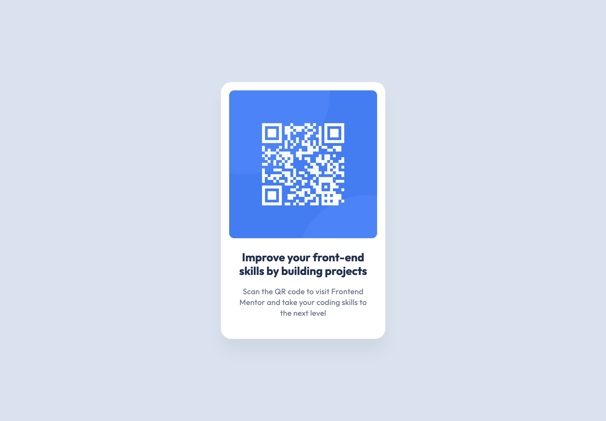

# Frontend Mentor - QR code component solution

This is a solution to the [QR code component challenge on Frontend Mentor](https://www.frontendmentor.io/challenges/qr-code-component-iux_sIO_H). Frontend Mentor challenges help you improve your coding skills by building realistic projects.

## Table of contents

- [Frontend Mentor - QR code component solution](#frontend-mentor---qr-code-component-solution)
  - [Table of contents](#table-of-contents)
  - [Overview](#overview)
    - [Screenshot](#screenshot)
    - [Links](#links)
  - [My process](#my-process)
    - [Built with](#built-with)
    - [Useful resources](#useful-resources)
  - [Author](#author)

## Overview

### Screenshot

### Links

- Solution URL: [https://github.com/chiaminchen/qr-code-component](https://github.com/chiaminchen/qr-code-component)
- Live Site URL: [https://chiaminchen.github.io/qr-code-component/](https://chiaminchen.github.io/qr-code-component/)

## My process

### Built with

- Semantic HTML5 markup
- CSS custom properties
- Flexbox
- Mobile-first workflow
- [React](https://reactjs.org/) - JS library
- [Vite](https://vitejs.dev/) - Frontend tooling
- [Tailwind CSS v4](https://tailwindcss.com/) - Utility-first CSS framework

### Useful resources

- [MDN Web Docs](https://developer.mozilla.org/en-US/) - Helpful for looking up HTML/CSS documentation.
- [Tailwind CSS Documentation](https://tailwindcss.com/docs) - Excellent reference for utility classes and the new v4 features.

## Author

- Website - [https://github.com/chiaminchen](https://github.com/chiaminchen)
- Frontend Mentor - [@chiaminchen](https://www.frontendmentor.io/profile/chiaminchen)
